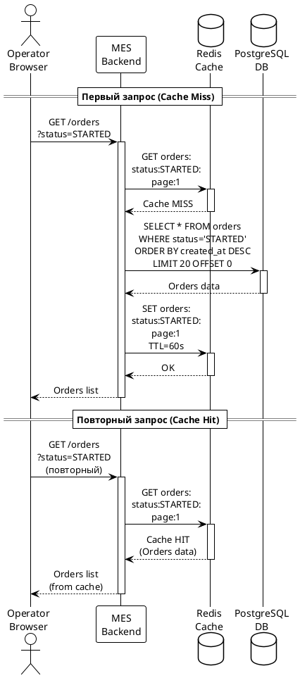
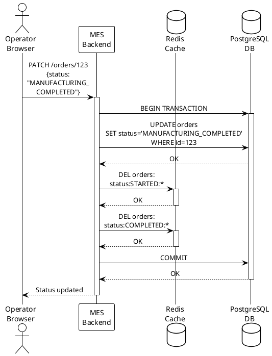
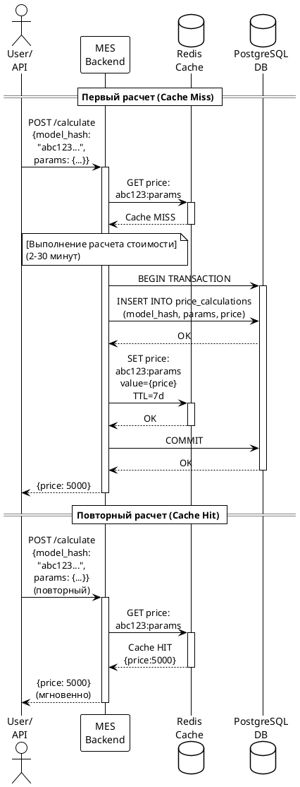

# Архитектурное решение по кешированию

## Мотивация

### Текущие проблемы

В системе MES выявлены критические проблемы производительности, которые негативно влияют на работу операторов и удовлетворенность клиентов:

1. **Медленная загрузка дашборда операторов**
   - Первая страница MES с дашбордом заказов долго прогружается
   - Операторам критически важно видеть самые новые заказы для получения вознаграждения
   - Фильтрация по статусам и пагинация не решили проблему производительности

2. **Высокая нагрузка на базу данных**
   - Каждый оператор при открытии дашборда выполняет запросы к БД
   - Запросы включают фильтрацию, сортировку и агрегацию данных по заказам
   - С ростом количества заказов (линейный рост +100 заказов/месяц) нагрузка увеличивается

3. **Долгий расчет стоимости заказов**
   - Расчет стоимости занимает 2-3 минуты в среднем
   - Для сложных моделей время может достигать 30 минут
   - Повторные запросы на расчет одной и той же модели выполняются заново

4. **Масштабирование проблем**
   - Открытие API для B2B-клиентов увеличило нагрузку
   - Количество жалоб на просроченные заказы растет
   - Потеря крупных контрактов из-за проблем с производительностью

### Цели внедрения кеширования

Внедрение кеширования позволит:

1. **Ускорить загрузку дашборда операторов**
   - Кешировать результаты запросов списка заказов по статусам
   - Снизить нагрузку на базу данных при частых обращениях к одним и тем же данным
   - Обеспечить быстрый доступ к актуальным данным о новых заказах

2. **Оптимизировать расчет стоимости**
   - Кешировать результаты расчета стоимости для идентичных 3D-моделей
   - Избежать повторных вычислений для одинаковых моделей
   - Ускорить обработку заказов от B2B-клиентов с типовыми моделями

3. **Снизить нагрузку на инфраструктуру**
   - Уменьшить количество запросов к базе данных
   - Снизить нагрузку на вычислительные ресурсы MES
   - Улучшить общую отзывчивость системы

### Элементы системы для кеширования

На основе анализа определены следующие элементы для кеширования:

1. **Список заказов на дашборде MES** (приоритет: высокий)
   - Запросы с фильтрацией по статусам
   - Агрегированные данные по заказам
   - Результаты пагинации

2. **Результаты расчета стоимости изделий** (приоритет: высокий)
   - Кеш на основе хеша 3D-модели
   - Параметры расчета (материал, сложность и т.д.)

3. **Справочные данные** (приоритет: средний)
   - Статусы заказов
   - Справочники материалов
   - Настройки системы

## Предлагаемое решение

### Выбор типа кеширования

Для решения проблем MES предлагается использовать **серверное кеширование** с применением Redis в качестве кеш-хранилища.

#### Обоснование выбора серверного кеширования

**Почему серверное кеширование:**

1. **Централизованное управление данными**
   - Все операторы получают доступ к одному кешу
   - Консистентность данных между пользователями
   - Упрощенная инвалидация кеша

2. **Снижение нагрузки на базу данных**
   - Запросы обрабатываются на уровне кеша, а не БД
   - Критично для текущей архитектуры с одним инстансом БД

3. **Поддержка сложных вычислений**
   - Кеширование результатов расчета стоимости (CPU-intensive операции)
   - Невозможно эффективно кешировать на клиенте

4. **Масштабируемость**
   - Легко масштабируется при росте нагрузки
   - Поддержка кластеризации Redis

**Почему не клиентское кеширование:**

- Не решает проблему нагрузки на БД и вычислительные ресурсы
- Сложность синхронизации данных между клиентами
- Невозможность кешировать результаты расчета стоимости
- Ограниченный контроль над инвалидацией кеша

### Паттерны кеширования

Для разных элементов системы предлагается использовать разные паттерны:

#### 1. Cache-Aside для списка заказов на дашборде

**Описание:**
- Приложение сначала проверяет наличие данных в кеше
- При отсутствии данных запрашивает их из БД и сохраняет в кеш
- При последующих запросах данные берутся из кеша

**Обоснование выбора:**

**Преимущества:**
- Простота реализации и отладки
- Кеш заполняется только востребованными данными (lazy loading)
- Отказоустойчивость: при недоступности кеша система продолжает работать
- Полный контроль над логикой кеширования в приложении
- Подходит для read-heavy операций (дашборд операторов)

**Почему не Write-Through:**
- Избыточная сложность для read-heavy сценария
- Каждое обновление заказа требует записи в кеш, даже если данные не запрашиваются
- Увеличивает latency операций записи
- Не критично для дашборда, где важнее скорость чтения

**Почему не Refresh-Ahead:**
- Сложность предсказания, какие данные понадобятся
- Риск кеширования невостребованных данных
- Дополнительная нагрузка на БД для предзагрузки
- Избыточная сложность реализации

#### 2. Write-Through для расчета стоимости

**Описание:**
- При расчете стоимости результат одновременно сохраняется в БД и кеш
- Последующие запросы на расчет идентичной модели берутся из кеша
- Гарантируется консистентность между БД и кешем

**Обоснование выбора:**

**Преимущества:**
- Гарантия консистентности данных между БД и кешем
- Результат расчета сразу доступен для повторных запросов
- Критично для B2B-клиентов, которые могут запрашивать расчет одной модели многократно
- Снижение нагрузки на вычислительные ресурсы

**Почему именно для расчета стоимости:**
- Операция write происходит редко (только при новом расчете)
- Результат расчета не меняется для идентичной модели
- Высокая стоимость повторного вычисления (2-30 минут)

**Почему не Cache-Aside:**
- Риск race condition при одновременных запросах на расчет одной модели
- Возможна несогласованность между БД и кешем
- Дополнительная логика для проверки актуальности кеша

### Архитектура решения

[архитектура_кеширования](архитектура_кеширования.drawio)


### Sequence Diagram: Чтение списка заказов (Cache-Aside)



### Sequence Diagram: Изменение статуса заказа с инвалидацией кеша



### Sequence Diagram: Расчет стоимости (Write-Through)




## Стратегия инвалидации кеша

Для обеспечения актуальности данных предлагается использовать **комбинированную стратегию инвалидации**, которая включает несколько подходов в зависимости от типа данных.

### 1. Временная инвалидация (TTL) для списка заказов

**Описание:**
- Кеш автоматически удаляется по истечении времени жизни (TTL)
- Для списка заказов на дашборде: TTL = 60 секунд
- Для справочных данных: TTL = 1 час

**Обоснование:**

**Преимущества:**
- Простота реализации
- Автоматическая очистка устаревших данных
- Предсказуемое поведение системы
- Баланс между актуальностью и производительностью

**Почему подходит для дашборда:**
- Операторам не критична задержка в 60 секунд для обновления списка
- Снижает нагрузку на БД при частых обновлениях страницы
- Новые заказы появятся в течение минуты

### 2. Программная инвалидация по событиям для изменения статусов

**Описание:**
- При изменении статуса заказа кеш инвалидируется программно
- Удаляются все кеш-записи, связанные с измененным статусом
- Используется паттерн "invalidate on write"

**Обоснование:**

**Преимущества:**
- Гарантирует актуальность данных после изменений
- Точечная инвалидация только затронутых данных
- Быстрое отражение критичных изменений

**Почему подходит для статусов:**
- Изменение статуса — критичное событие
- Операторы должны видеть актуальное состояние заказов
- Частота изменений относительно невысокая

### 3. Долгосрочное кеширование для расчета стоимости

**Описание:**
- Результаты расчета стоимости кешируются на длительный срок (7 дней)
- Инвалидация только при изменении алгоритма расчета или справочников цен
- Используется хеш модели как ключ кеша

**Обоснование:**

**Преимущества:**
- Максимальная эффективность для дорогостоящих вычислений
- Результат расчета для идентичной модели не меняется
- Значительное снижение нагрузки на вычислительные ресурсы

**Почему подходит для расчета стоимости:**
- Результат детерминирован (одинаковая модель = одинаковая цена)
- Высокая стоимость повторного вычисления (2-30 минут)
- Изменения в алгоритме расчета происходят редко

### 4. Ручная инвалидация для справочников

**Описание:**
- При обновлении справочников (материалы, настройки) кеш инвалидируется вручную
- Предоставляется административный интерфейс для очистки кеша
- Используется при деплое новых версий с изменениями в бизнес-логике

**Обоснование:**

**Преимущества:**
- Полный контроль над инвалидацией
- Возможность очистки кеша при критичных изменениях
- Не требует сложной логики отслеживания зависимостей

### Сравнительный анализ стратегий инвалидации

| Критерий | Временная (TTL) | Программная (по событиям) | Долгосрочная | Ручная |
|----------|-----------------|---------------------------|--------------|--------|
| **Актуальность данных** | Средняя (задержка до TTL) | Высокая (мгновенная) | Низкая (до изменения алгоритма) | Высокая (по требованию) |
| **Сложность реализации** | Низкая | Средняя | Низкая | Низкая |
| **Нагрузка на систему** | Низкая | Средняя (при частых изменениях) | Минимальная | Минимальная |
| **Риск устаревших данных** | Низкий (контролируемый) | Минимальный | Средний | Низкий |
| **Применимость** | Часто меняющиеся данные | Критичные изменения | Неизменяемые результаты | Редкие изменения |
| **Использование для** | Список заказов | Изменение статусов | Расчет стоимости | Справочники |

### Почему не подходят другие стратегии

**Только временная инвалидация для всех данных:**
- Критичные изменения статусов будут видны с задержкой
- Операторы могут взять в работу уже занятый заказ
- Неприемлемо для бизнес-логики

**Только программная инвалидация:**
- Избыточная сложность для некритичных данных
- Риск забыть инвалидировать кеш в каком-то месте кода
- Дополнительная нагрузка на разработку и поддержку

**Инвалидация по ключу без TTL:**
- Риск накопления устаревших данных
- Утечка памяти при неправильной инвалидации
- Сложность отслеживания всех зависимостей


## Сравнительный анализ решений

### Решение 1: Redis с комбинированной стратегией (рекомендуемое)

**Описание:**
- Использование Redis как единого кеш-хранилища
- Cache-Aside для дашборда заказов
- Write-Through для расчета стоимости
- Комбинированная стратегия инвалидации (TTL + программная)

**Архитектура:**
```
MES Backend → Redis Cache → PostgreSQL DB
     ↓
Cache-Aside (Dashboard)
Write-Through (Price Calculation)
```

**Плюсы:**
- Простота реализации и поддержки
- Высокая производительность (in-memory, <1ms latency)
- Богатый функционал Redis (TTL, паттерны ключей, pub/sub, транзакции)
- Готовые библиотеки для C# (StackExchange.Redis)
- Возможность масштабирования (Redis Cluster, Redis Sentinel)
- Поддержка персистентности данных (RDB/AOF)
- Подходит для текущей команды (не требует специальных знаний)
- Managed service в Yandex Cloud (упрощенное обслуживание)
- Поддержка сложных структур данных (Hash, List, Set, Sorted Set)
- Встроенные механизмы репликации и отказоустойчивости

**Минусы:**
- Дополнительный компонент инфраструктуры
- Требует мониторинга и обслуживания
- Стоимость инфраструктуры
- Риск потери данных при сбое (если не настроена персистентность)
- Необходимость обучения команды работе с Redis

### Решение 2: Memcached с упрощенной стратегией

**Описание:**
- Использование Memcached как кеш-хранилища
- Только Cache-Aside паттерн
- Только временная инвалидация (TTL)

**Архитектура:**
```
MES Backend → Memcached → PostgreSQL DB
     ↓
Cache-Aside (все операции)
```

**Плюсы:**
- Простота и минимализм
- Высокая производительность
- Меньше потребление памяти (более эффективное использование)
- Проще в настройке и обслуживании
- Меньше overhead на операции

**Минусы:**
- Ограниченный функционал (только key-value)
- Нет персистентности данных
- Нет поддержки сложных структур данных
- Сложнее реализовать программную инвалидацию
- Нет pub/sub для координации между инстансами
- Менее гибкая стратегия инвалидации
- Нет транзакций
- Сложнее масштабировать (нет встроенной кластеризации)

### Решение 3: Гибридное решение (Redis + CDN)

**Описание:**
- Redis для серверного кеширования
- CDN (CloudFront/Yandex CDN) для статических данных и API responses
- Многоуровневое кеширование

**Архитектура:**
```
Browser → CDN → MES Backend → Redis → PostgreSQL DB
```

**Плюсы:**
- Максимальная производительность
- Снижение нагрузки на backend
- Географическое распределение (важно для B2B-клиентов)
- Кеширование на уровне HTTP
- Защита от DDoS

**Минусы:**
- Высокая сложность реализации
- Сложность инвалидации кеша на нескольких уровнях
- Дополнительные затраты на CDN
- Избыточно для текущих задач
- Требует значительных изменений в архитектуре
- Долгий срок внедрения

### Сравнительная таблица решений

| Критерий | Redis (Решение 1) | Memcached (Решение 2) | Гибридное (Решение 3) |
|----------|-------------------|----------------------|----------------------|
| **Сложность внедрения** | Средняя  | Низкая  | Высокая  |
| **Гибкость инвалидации** | Высокая | Низкая | Высокая |
| **Масштабируемость** | Отличная | Хорошая | Отличная |
| **Поддержка команды** | Средняя | Простая | Сложная |
| **Функциональность** | Богатая | Базовая | Очень богатая |
| **Персистентность** | Да | Нет | Да |
| **Подходит для расчета стоимости** | Да | Ограниченно | Да |
| **Риски** | Низкие | Средние | Средние |

## Заключение и рекомендация

### Рекомендуемое решение: Redis с комбинированной стратегией (Решение 1)

**Обоснование выбора:**

1. **Оптимальный баланс сложности и эффективности**
   - Решение достаточно простое для внедрения за 2-3 недели
   - Обеспечивает значительное улучшение производительности (5-10x)
   - Не требует радикальных изменений в архитектуре

2. **Решает все выявленные проблемы**
   - Ускоряет загрузку дашборда операторов
   - Оптимизирует расчет стоимости
   - Снижает нагрузку на БД
   - Поддерживает рост нагрузки

3. **Гибкость и масштабируемость**
   - Поддержка различных паттернов кеширования
   - Возможность масштабирования при дальнейшем росте
   - Богатый функционал для будущих задач

4. **Соответствие возможностям команды**
   - Не требует специальных знаний
   - Хорошая документация и community support
   - Managed service в Yandex Cloud упрощает обслуживание

5. **Быстрый ROI**
   - Окупается за 1-2 месяца за счет удержания клиентов
   - Предотвращает потерю крупных контрактов
   - Улучшает удовлетворенность операторов

**Почему не другие решения:**

- **Memcached (Решение 2):** Хотя проще в реализации, не обеспечивает достаточной гибкости для решения всех проблем, особенно для оптимизации расчета стоимости. Ограниченный функционал может стать узким местом при дальнейшем развитии.

- **Гибридное решение (Решение 3):** Избыточно сложное для текущих задач. Высокая стоимость и длительный срок внедрения не оправданы текущими проблемами. Может рассматриваться как следующий этап развития после успешного внедрения Redis
